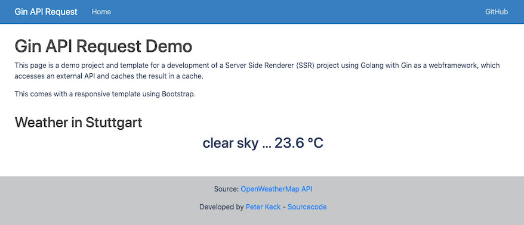

<h1 align="center">Welcome to Gin-api-request 👋</h1>
<p>
  
  <a href="https://github.com/pyrrolizin/gin-api-request/blob/master/LICENSE" target="_blank">
    
  </a>
</p>

>This project is a starting platform for a Golang project with Gin webframework that pulls data from an external API and caches the result.
>The project includes a responsive Bootstrap template.

## 🏠 [Homepage](https://github.com/pyrrolizin/gin-api-request)

## ✨ Demo (OpenWeatherMap-Api - Current weather in Stuttgart, Germany)

tbd



## Prerequisit

* golang > 1.18

### Installation

```sh
go install
```

### Environment varaibles

You can set the following environment variables:

| NAME        |  *required*  |  Comment  |
| ----------- | ------------ | --------- |
| `API_KEY`   | **yes**      |  You can get your own free OpenWeatherApi key on this website: https://home.openweathermap.org/users/sign_up   |
| `HOST`      | **yes**      |  Listening on given ip adress (default: "" maps to 0.0.0.0)   |
| `PORT`      | **yes**      |  Listening on given port (default: 8080)   |

You can either set the environment variables or use the `.env` file:
Make your own copy of the `.env` file and specify the `.env` and add the keys. 

```sh
cp ./.env_default ./.env
```

Learn more about the OpenWeatherMap API: https://openweathermap.org/api

## Getting Started

First, run the development server:

```bash
go run main.go
```

Open [http://localhost:8080](http://localhost:8080) with your browser to see the result.

## compile and start from source

```bash
go build main.go
./main
```
